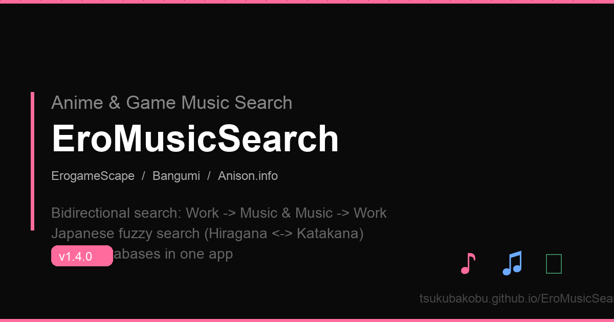

# EroMusicSearch

> ゲーム・アニメ楽曲の双方向検索ツール — 3 つのデータベースを横断検索  
> A bidirectional ACG music metadata search tool — cross-search across 3 databases

<p align="center">
  
</p>

[](https://github.com/TsukubaKobu/EroMusicSearch/actions/workflows/ci.yml)
[](https://github.com/TsukubaKobu/EroMusicSearch/releases)
[](./LICENSE)
[](https://github.com/TsukubaKobu/EroMusicSearch/releases)

---

## 概要 / Overview

EroMusicSearch は、**3 つのデータソース**（ErogameScape・Bangumi・Anison.info）からゲームやアニメの楽曲情報を横断的に検索できるデスクトップアプリです。曲名から作品を調べる「逆引き」、作品名から全 OP/ED/IN を一覧する「順引き」の両方に対応。検索結果は自動キャッシュされ、オフラインでも再表示可能です。

EroMusicSearch is a desktop app that searches **3 data sources** (ErogameScape, Bangumi, Anison.info) for game/anime music metadata. Supports both "reverse lookup" (song → work) and "forward lookup" (work → all songs). Results are automatically cached and available offline.

---

## データソース / Data Sources

| Source | Genre | Method | Strengths |
|--------|-------|--------|-----------|
| **ErogameScape** (批評空間) | Galgame / Eroge | SQL POST → HTML scraping | Most comprehensive galgame music DB |
| **Bangumi** (番組計画) | Anime / Games | REST API (`api.bgm.tv`) | Japanese title native support, API-based |
| **Anison.info** | Anime / Games / Movies | HTML scraping | Anisong specialist, full OP/ED/IN/AR coverage |

**検索モード / Search Modes** — 6 total (3 sources × 2 directions):

| 方向 / Direction | 説明 / Description |
|------------------|-------------------|
| 作品 → 音楽 / Work → Music | 作品名から全楽曲を一覧 / List all songs by work title |
| 音楽 → 作品 / Music → Work | 曲名から使用作品を逆引き / Find which work a song belongs to |

---

## 機能 / Features

### 検索 / Search
- **6 検索モード** — データソース選択 + 方向切替ボタンで直感的に操作
- **日本語ファジー検索** — ErogameScape でひらがな↔カタカナ自動変換
- **CN ミラー対応** — 設定から有効化で `koko.kyara.top` 経由に切替（中国本土向け）
- **15 秒タイムアウト** — 外部 API 無応答時に自動切断、フリーズ防止

### 結果表示 / Results
- **テーブルソート** — カラムヘッダークリックで昇順/降順（日本語対応 `localeCompare`）
- **カラムリサイズ** — ヘッダー境界のドラッグで列幅を調整
- **クリックでコピー** — 任意のセルをクリックでクリップボードにコピー
- **ステータス統一表示** — ローダー・エラー・結果なし・キャッシュ表示を単一ステータスバーに統合

### キャッシュ / Cache
- **検索結果の自動キャッシュ** — 検索語ごとに結果をローカル保存
- **アイテムレベル粒度** — 各行単位でキャッシュ、再検索時に即座に表示
- **キャッシュファースト戦略** — キャッシュを即表示しつつ、バックグラウンドで最新データを取得
- **オフライン対応** — キャッシュ済みの検索結果はインターネットなしでも表示
- **キャッシュクリア** — 設定メニューからワンクリックで全キャッシュ削除

### 設定 / Settings
- **デフォルトデータソース** — 起動時に選択されるデータソースを設定
- **デフォルト検索方向** — 作品→音楽 / 音楽→作品 の既定値を設定
- **デフォルト CN ミラー** — CN ミラーの初期状態を設定
- **キャッシュクリア** — エントリ数表示付き

### UI
- **ミニマルデザイン** — ダークモード、hiddenInset タイトルバー、最小限の UI
- **ウィンドウ位置記憶** — 閉じた時の位置とサイズを次回起動時に復元
- **狭小ウィンドウ対応** — 最小幅制限なし、検索バー横スクロール対応
- **ポップアップ設定メニュー** — 超狭小ウィンドウでも表示可能な動的 Y 位置調整

---

## スクリーンショット / Screenshot

```
┌──────────────────────────────────────────────────┐
│  [Anison.info ▼] [作品→曲] [紅蓮の弓矢    ] [⚙]  │
├────────────────┬──────────┬──────────────────────┤
│ 楽曲 ↑          │ 分類      │ 作品                  │
├────────────────┼──────────┼──────────────────────┤
│ 紅蓮の弓矢       │ OP 1 [TV]│ 進撃の巨人             │
│ 自由の翼         │ OP 2 [TV]│ 進撃の巨人             │
│ 心臓を捧げよ！    │ OP 3 [TV]│ 進撃の巨人             │
└────────────────┴──────────┴──────────────────────┘
```

---

## インストール / Installation

### macOS

1. [Releases](https://github.com/TsukubaKobu/EroMusicSearch/releases) から DMG をダウンロード:
   - `EroMusicSearch-1.6.0-arm64.dmg` — Apple Silicon (M1/M2/M3/M4)
   - `EroMusicSearch-1.6.0.dmg` — Intel Mac
2. DMG を開き、アプリを `Applications` フォルダへドラッグ
3. 初回起動時は **右クリック → 開く**（Gatekeeper 未署名のため）

### Windows

1. [Releases](https://github.com/TsukubaKobu/EroMusicSearch/releases) から `EroMusicSearch Setup x.x.x.exe` をダウンロード
2. インストーラーを実行（インストール先の変更可能）

---

## 開発 / Development

### 必要環境 / Prerequisites

- [Node.js](https://nodejs.org/) >= 22
- npm >= 10

### セットアップ / Setup

```bash
# 依存パッケージのインストール
npm install

# 開発モードで起動
npm start

# テスト実行
npm test

# リント
npm run lint

# フォーマット
npm run format
```

### ビルド / Build

```bash
# macOS 向けパッケージのビルド（DMG）
npm run dist

# Windows 向けクロスコンパイル
npx electron-builder --win --x64
```

### プロジェクト構造 / Project Structure

```
EroMusicSearch/
├── main.js              # Electron メインプロセス
├── preload.js           # コンテキストブリッジ (IPC)
├── renderer.js          # フロントエンドロジック
├── index.html           # UI (シングルページ)
├── styles.css           # スタイル (ダークテーマ)
├── package.json         # マニフェスト・ビルド設定
├── src/                 # 検索エンジンモジュール
│   ├── constants.js     # 定数・ユーティリティ
│   ├── erogamescape.js  # EGS 検索
│   ├── bangumi.js       # Bangumi 検索
│   └── anison.js        # Anison 検索
├── test/                # ユニットテスト (node:test)
│   ├── constants.test.js
│   ├── erogamescape.test.js
│   ├── bangumi.test.js
│   ├── anison.test.js
│   └── cache.test.js
├── docs/                # GitHub Pages・仕様書
├── .github/workflows/   # CI (lint + test)
└── dist/                # ビルド成果物 (非 git 管理)
```

### アーキテクチャ / Architecture

```
┌──────────────────────────────────────┐
│  Main Process (main.js)              │
│  ├─ IPC handlers (search/cache)      │
│  ├─ State persistence (JSON files)   │
│  └─ Warm-up (EGS endpoint pre-fetch) │
└────────────┬─────────────────────────┘
             │ contextBridge (preload.js)
┌────────────▼─────────────────────────┐
│  Renderer Process (index.html + js)  │
│  ├─ Cache-first display strategy     │
│  ├─ Table sort / resize / click-copy │
│  └─ Settings menu (gear popup)       │
└──────────────────────────────────────┘
```

---

## テックスタック / Tech Stack

| Layer | Technology | Version |
|-------|-----------|---------|
| Desktop Framework | [Electron](https://www.electronjs.org/) | 34.x |
| UI | Vanilla HTML / CSS / JavaScript | — |
| HTML Parsing | [Cheerio](https://cheerio.js.org/) | 1.x |
| Bangumi API | [api.bgm.tv](https://bangumi.github.io/api/) | REST |
| Testing | Node.js built-in (`node:test` + `node:assert`) | — |
| Linting | ESLint + Prettier + EditorConfig | 10.x / 3.x |
| CI | GitHub Actions | — |
| Build | electron-builder | 25.x |

---

## バージョン履歴 / Changelog

詳細は [CHANGELOG.md](./CHANGELOG.md) を参照。

| Version | Highlights |
|---------|-----------|
| **v1.6.0** | UI 簡素化（ソース・方向分離、切替ボタン）、アイテムレベルキャッシュ、カラムリサイズ、狭小ウィンドウ対応、CI・テスト整備 |
| **v1.5.0** | キャッシュ機能、設定メニュー、テーブルソート、ウィンドウ位置記憶 |
| **v1.4.0** | タイムアウト保護、コードモジュール化、CN ミラー自動非表示、Intel Mac 対応 |
| **v1.3.0** | Anison.info を第 3 データソースとして追加 |
| **v1.2.0** | 初回検索バグ修正（セッション競合）、起動時ウォームアップ |
| **v1.1.0** | CN ミラー対応、Windows ビルド、UI 整理 |
| **v1.0.0** | 初回リリース（ErogameScape + Bangumi） |

---

## ライセンス / License

MIT © [TsukubaKobu](https://github.com/TsukubaKobu)
